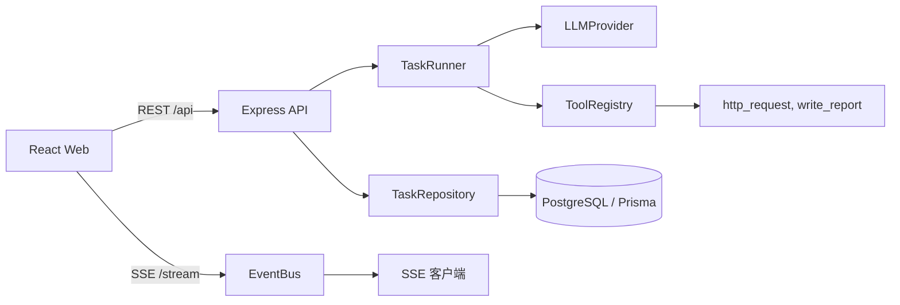

# 架构说明

## 总览



## 核心设计

### 事件溯源式运行记录

任务每次运行的每个事件都写入 `task_events` 表，并带任务内自增的 `seq`。前端刷新页面或 SSE 断线后，通过 `Last-Event-ID` 从断点续传；历史任务可以按事件完整回放。

事件类型：

```text
task.created
task.plan_updated
task.status_changed
tool.started
tool.finished
message.delta
message.assistant
task.completed
task.failed
```

`message.assistant` 保存助手完整回复、本轮请求的工具调用，以及可选的真实模型 `finishReason` 和 token `usage`；前端据此把事件流还原为“用户 → 助手 → 工具调用 → 工具结果”的对话记录。

### 任务状态机

```text
queued -> planning -> running <-> paused
                    -> completed | failed | cancelled
```

非法迁移会被 `StateTransitionError` 拒绝。暂停是协作式暂停：只在步骤边界生效，不会中断正在执行的工具调用。

### ToolRegistry

工具统一通过 `ToolRegistry` 注册，每个工具声明 `name`、`description`、`inputSchema` 和 `execute`。执行前用 zod 校验参数，工具列表也会传给 LLM 用于规划。内置 `http_request` 允许 Agent 在任务执行中调用外部 HTTP(S) API，并通过 `HTTP_TOOL_ALLOWED_HOSTS` 等环境变量限制目标地址、超时和响应大小；`write_report` 将报告内容保存为任务产出物。

### LLM Provider

`LLMProvider` 抽象了 Agent 循环所需的对话能力：

- Mock：确定性输出，离线可跑，适合开发和测试
- OpenAI 兼容：通过 `chat/completions` 调用，支持流式输出、多轮 tool calling、`finishReason` 与 token usage
- 上下文裁剪：每次调用前按 `maxContextTokens` 与 `maxHistoryMessages` 保留 system、最后一个 user 和最近若干轮助手/工具消息

工具列表通过 ToolRegistry 注入 LLM，模型可以在同一轮中请求多个工具，工具结果回填后再继续下一轮对话。

## 数据表

- `tasks`：任务主表，保存目标、状态、进度和耗时
- `workspaces`：工作区表，任务通过 `workspace_id` 分组
- `task_events`：事件表，保存任务运行的全部事件

## 前端状态分工

- TanStack Query：任务列表、任务详情、历史事件、统计等服务端状态
- Zustand：SSE 连接状态和实时事件，避免流式数据污染 Query Cache
- SSE：服务端单向推送，浏览器自动维护 `Last-Event-ID`，重连后自动补事件
